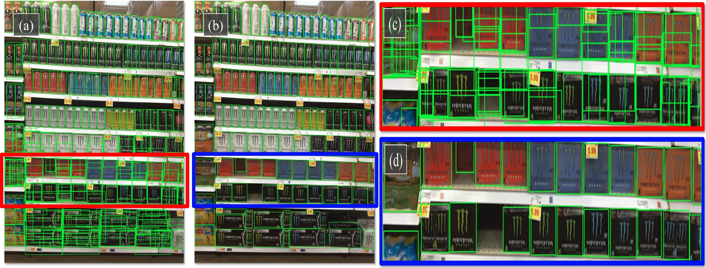
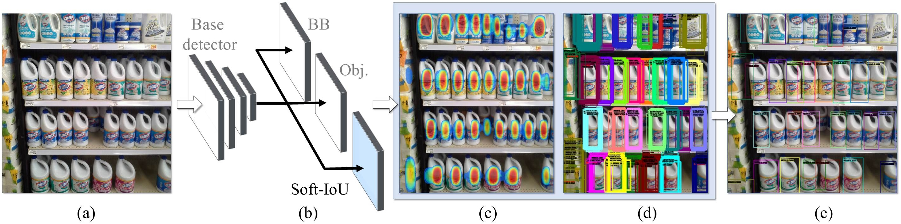

# Shelf-product-identification

Dataset and Codebase for CVPR2019 "Precise Detection in Densely Packed Scenes" [[Paper link]](https://arxiv.org/pdf/1904.00853.pdf)

<!---[alt text](figures/teaser_width.jpg)--->


A typical image in our SKU-110K, showing densely packed objects. (a) Detection results for the state-of-the-art RetinaNet[2], showing incorrect and overlapping detections, especially for the dark objects at the bottom which are harder to separate. (b) Our results showing far fewer misdetections and better fitting bounding boxes. (c) Zoomed-in views for RetinaNet[2] and (d) our method.


### to do list:
- [x] **Analyze customer data**
- [x] **Fine-tuning on customer data**
- [x] **Evaluation of mAP**
- [ ] **Use Flask to deploy endpoint**
- [ ] **Use Amazon SageMaker to host endpoint**


## Introduction
In our SKU-110K paper[1] we focus on detection in densely packed scenes, where images contain many objects, often looking similar or even identical, positioned in close proximity. These scenes are typically man-made, with examples including retail shelf displays, traffic, and urban landscape images. Despite the abundance of such environments, they are under-represented in existing object detection benchmarks, therefore, it is unsurprising that state-of-the-art object detectors are challenged by such images.


## Method
We propose learning the Jaccard index with a soft Intersection over Union (Soft-IoU) network layer. This measure provides valuable information on the quality of detection boxes. Those detections can be represented as a Mixture of Gaussians (MoG), reflecting their locations and their Soft-IoU scores. Then, an Expectation-Maximization (EM) based method is then used to cluster these Gaussians into groups, resolving detection overlap conflicts. 



System diagram: (a) Input image. (b) A base network, with bounding box (BB) and objectness (Obj.) heads, along
with our novel Soft-IoU layer. (c) Our EM-Merger converts Soft-IoU to Gaussian heat-map representing (d) objects captured by
multiple, overlapping bounding boxes. (e) It then analyzes these box clusters, producing a single detection per object


## Qualitative Results

**mAP=0.285 in customer dataset.**


## Usage

Move the unzipped customer folder to "./"

Set $PYTHONPATH to the repository root 

e.g. from this repository: `export PYTHONPATH=$(pwd)`

train:

(1) Train the base model:
`python -u object_detector_retinanet/keras_retinanet/bin/train.py csv`

(2) Train the IoU layer:

`python -u object_detector_retinanet/keras_retinanet/bin/train_iou.py --weights WEIGHT_FILE csv`
where WEIGHT_FILE is the full path to the h5 file from step (1)

e.g.:
`python -u object_detector_retinanet/keras_retinanet/bin/train_iou.py --gpu 0 --weights "/home/ubuntu/Documents/SKU110K/snapshot/Thu_May__2_17:07:11_2019/resnet50_csv_10.h5" csv | tee train_iou_sku110k.log`


(3) predict:

`python -u object_detector_retinanet/keras_retinanet/bin/predict.py csv WEIGHT_FILE [--hard_score_rate=RATE]`
where WEIGHT_FILE is the full path to the h5 file from step (2), and 0<=RATE<=1 computes the confidence as a weighted average between soft and hard scores. 

e.g:
`nohup env PYTHONPATH="/home/ubuntu/dev/SKU110K" python -u object_detector_retinanet/keras_retinanet/bin/predict.py --gpu 3 csv "/home/ubuntu/Documents/SKU110K/snapshot/Thu_May__2_17:10:30_2019/iou_resnet50_csv_07.h5" --hard_score_rate=0.5 | tee predict_sku110k.log`


The results are saved in CSV format in the "results" folder and drawn in "res_images_iou" folder.

## References
[1] Eran Goldman*, Roei Herzig*, Aviv Eisenschtat*, Jacob Goldberger, Tal Hassner, [Precise Detection in Densely Packed Scenes](https://arxiv.org/abs/1904.00853), 2019.

[2] Tsung-Yi Lin, Priyal Goyal, Ross Girshick, Kaiming He, Piotr Dollar, [Focal loss for dense object detection](https://arxiv.org/abs/1708.02002), 2018.


## Citation

```
@inproceedings{goldman2019dense,
 author    = {Eran Goldman and Roei Herzig and Aviv Eisenschtat and Jacob Goldberger and Tal Hassner},
 title     = {Precise Detection in Densely Packed Scenes},
 booktitle = {Proc. Conf. Comput. Vision Pattern Recognition (CVPR)},
 year      = {2019}
}
```
